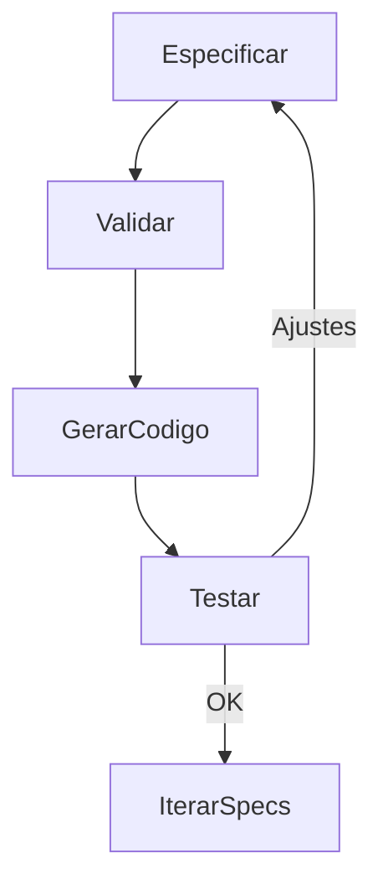

# Checklist de Validação (SDD) e Fluxo

Use antes de gerar código. Não avance se algum item estiver em aberto.

## Contexto Global (00-global-context)
- Visão, objetivos e escopo definidos e claros.
- Requisitos não funcionais globais mensuráveis e testáveis.
- Estratégia de distribuição, configuração e integração definida.
- Convenções e guardrails globais estabelecidos.
- Riscos e decisões em aberto identificados.

## Arquitetura (00-architecture)
- Padrão arquitetural definido e justificado.
- Estrutura de diretórios acordada e consistente com geração/empacotamento.
- Módulos e componentes identificados com responsabilidades claras.
- Isolamento e testabilidade garantidos (interfaces, adapters, mocks).
- Padrões de design aplicados e documentados.
- Convenções arquiteturais estabelecidas.

## Stack Técnica (00-stack)
- Linguagem e versão definidas e documentadas.
- Ferramentas de build e desenvolvimento especificadas.
- Plataformas alvo especificadas.
- Formato de empacotamento definido (com checksum/assinatura).
- Guardrails de dependências e build estabelecidos.
- Critérios de build reproduzível definidos.

## Primeira Funcionalidade (01-*.spec)
- Comando, flags, args, envs e outputs definidos com formatos/códigos.
- Fluxo feliz e erros previstos cobertos, com mensagens e comportamento de retry/backoff.
- Integrações (API/FS/SO) com contratos e timeouts definidos.
- NFRs específicos do comando (latência alvo, compatibilidade).
- Critérios de aceite objetivos (saída, código, mensagens) para happy path e erros.
- Testes descritos (unidade, integração, e2e) com como rodar e fixtures.
- Migração/rollback definidos se tocar estado.

## Fluxo SDD (Mermaid)

